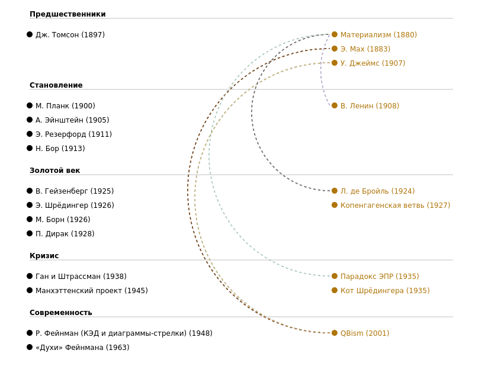

# Комфортабельное квантовое путешествие

Некоторое время назад я почувствовал, что пора, наконец, закрыть этот чёртов гештальт с квантовой механикой. Знания, позволяющие уверенно ориентироваться в ней, давно перестали быть делом вкуса, таким, как коллекционирование почтовых марок или разведение аквариумных рыбок. В наши дни  непозволительно оставаться невеждой в этой теме. Но как разобраться в ней, не тратя на изучение месяцы и даже годы, которыми жертвуют те, кто решил связать свою судьбу с исследованием мира элементарных частиц? Можно, конечно, почитать Википедию, но ее авторы обязаны придерживаться довольно строгих правил, поэтому тексты там живостью изложения не отличаются. Должен быть кто-то, кто расскажет «простым смертным» вроде меня об азах квантовой физики так же кратко, обыденно и доходчиво, как стюардесса в самолете объясняет правила пользования спасательным жилетом. Следуя принципу «хочешь сделать хорошо — сделай сам», я решил попробовать свои силы в решении этой задачи.

Вспомнив всё, что уже знал по этой теме, посмотрев множество видеороликов на `Youtube`, прочитав несколько научно-популярных текстов, побеседовав с искусственным интеллектом, я пришел к выводу, что исторический подход к усвоению идей квантовой физики — самый эффективный. Добытые знания я свел в схему, оттолкнувшись от которой написал сопроводительный текст. Так получился этот краткий (даже кратчайщий) курс, одолеть который неподготовленный читатель может за один присест, то есть потратив около часа. 

Представленный здесь скриншот дает лишь общее понятие о получившейся схеме. На [веб-странице](https://yababay.github.io/comfortable-quantum/) она интерактивна: снабжена всплывающими подсказками и дополнениями, которые можно при необходимости скрывать и показывать.  

Материал подобран так, чтобы повествование было максимально компактным. Форма подачи — ироничная. В дело пошли анекдоты про прапорщиков, обзывательства (Поль Дирак — «баламут», Ричард Фейнман — «жулик») и другие выразительные средства, позволяющие преодолеть главный страх, мешающий погрузиться в изучение квантовой физики. Ведь в обыденном сознании она считается уделом «избранных», умнейших ученых XX и XXI вв. С этим не поспоришь, но это не значит, что обычные люди не могут полюбопытствовать, что там у них происходит. Лучшие умы, двигавшие науку в последние десятилетия, такие, как Ричард Фейнман, всеми силами стремились популяризировать свои достижения, так что грех не воспользоваться их приглашением и не потратить хотя бы пару часов на приобщение к знаниям, без которых не было бы ни современной электроники, ни полетов в космос, ни чудесной медицины, о которых наши предки не могли и мечтать. 

Текст находится [здесь](https://yababay.github.io/comfortable-quantum/).

